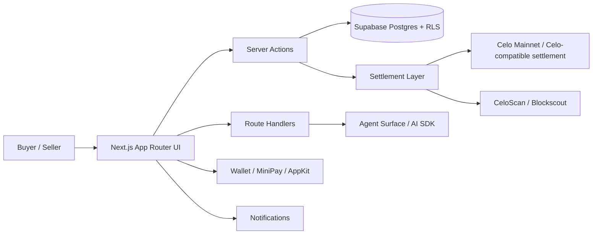

# LANARK

**Execution-layer marketplace agentic on-chain for B2B/B2C commerce on Celo.**

LANARK is a modular marketplace that combines traditional e-commerce UX with agentic execution, on-chain settlement, and mobile-first stablecoin payments. It is designed so a buyer can discover products, build a cart, authorize payment, and review the transaction history, while each seller manages its own storefront, inventory, orders, and metrics.

The README is written as a build-and-understand guide: a reader should be able to inspect the repo, understand the moving parts, and know how the product is wired without needing internal context.

The product is built around a clear principle:

> **Commerce stays practical off-chain; settlement and traceability stay verifiable on-chain.**

---

## What LANARK does

LANARK lets people:

- browse merchants and products
- add products to a persistent cart
- complete checkout from a mobile-first surface
- authorize payment with a wallet flow
- store and display transaction references
- inspect order history and CeloScan links
- operate a seller dashboard with real business metrics
- interact with an agent that helps execute commerce actions

LANARK is not just a catalog. It is an **execution layer** for commerce.

---

## Why this project exists

Traditional e-commerce often separates:

- discovery
- checkout
- payment
- traceability
- merchant operations

LANARK connects those layers into one system:

- the **buyer** gets a simple, guided purchase flow
- the **seller** gets a clean operational dashboard
- the **chain** provides settlement visibility and evidence
- the **agent** helps bridge intent into action

This is especially relevant for mobile commerce, emerging markets, and stablecoin-based transactions.

---

## Product principles

- **One checkout belongs to one shopkeeper**
- **The cart is persistent**
- **The buyer sees the real order state**
- **The seller only sees their own storefront**
- **The transaction hash is visible**
- **The order history is auditable**
- **The UX must feel fast and low-friction**
- **The chain must add value, not complexity**

---

## Architecture overview



---

## Core modules

### 1) Marketplace
The marketplace is the customer-facing discovery surface. It supports:

- products
- stores / merchants
- categories
- search
- filters
- horizontal browsing by store
- mobile-first exploration

### 2) Cart
The cart is a persistent commerce state, not a temporary UI toy.

It must preserve:

- selected products
- quantities
- seller boundaries
- checkout state
- price integrity

### 3) Checkout
Checkout is where the purchase becomes executable.

It handles:

- order creation
- authorization
- payment approval
- settlement readiness
- transaction visibility
- post-purchase history refresh

### 4) Agent Surface
The agent surface turns commerce intent into action.

The agent helps the buyer:

- search products
- find the right store
- add items
- complete checkout
- follow the order state
- continue by text or voice

### 5) Seller Dashboard
The seller dashboard is the operational control center for the shopkeeper.

It should show:

- orders received
- daily sales
- revenue
- top products
- recurring buyers
- inventory status
- transaction history
- settlement status

### 6) Wallet / History
The wallet and history surfaces provide:

- account context
- wallet address visibility
- copy-to-clipboard support
- current network
- balances
- order history
- CeloScan links

### 7) Settlement Layer
The settlement layer is responsible for the on-chain side of commerce:

- escrow / authorization flow
- transaction hashing
- receipt tracking
- on-chain traceability
- order state updates

---

## Networks and currency model

### Primary network
LANARK is built for **Celo Mainnet** as the production settlement environment.

### Stablecoins
The product supports a stablecoin-first commercial model.

- **COPm**: default commercial unit for Colombia-focused commerce
- **USDm**: canonical stablecoin unit for broader / non-Colombia flows

### Gas / execution
The UX should remain simple for end users. Where supported by the environment and wallet, the flow is designed to feel close to gas-sponsored commerce while the actual settlement remains on-chain and auditable.

### Important principle
- **Catalog, inventory, orders, and merchant operations stay off-chain**
- **Settlement, traceability, and proof of execution are anchored on-chain**

---

## Agentic commerce flow

### Buyer flow

1. Browse stores and products
2. Add products to the cart
3. Review checkout
4. Confirm shipping information
5. Authorize payment
6. Sign the transaction in the wallet
7. Receive order confirmation
8. View tx hash and CeloScan link
9. Open order history

### Seller flow

1. Manage storefront
2. Publish products
3. Update inventory
4. Receive orders
5. Track sales and metrics
6. Monitor settlement state
7. Follow recurring customer behavior

---

## Data model philosophy

LANARK is modular and server-action driven.

The system is organized around:

- `store`
- `product`
- `cart`
- `cart_item`
- `order`
- `order_item`
- `settlement`
- `order_event`
- `profile`
- `wallet`
- `notification`

### Rules

- each checkout belongs to a single seller/store
- order state must be explicit
- amounts must have one canonical conversion path
- data validation must be server-side
- seller data must stay isolated by tenant / role
- buyer and seller surfaces must remain separated

---

## On-chain / off-chain boundary

### Off-chain
Used for:

- catalog operations
- cart state
- merchant profile
- shipping address
- notifications
- analytics
- business metrics
- agent orchestration

### On-chain
Used for:

- settlement evidence
- transaction proof
- address / hash traceability
- escrow-style commerce logic
- verifiable state transitions

### Future privacy layer
LANARK is compatible with future privacy-preserving extensions, including selective disclosure and zero-knowledge proof patterns for compliance and identity proofs where needed.

---

## MiniPay compatibility

LANARK is designed to work in a mobile-first Celo environment, including MiniPay.

Key expectations:

- detect MiniPay when present
- use the wallet provided by the environment
- avoid forcing a secondary wallet setup
- keep the checkout flow simple
- maintain stablecoin-first commerce
- keep transaction references visible
- preserve the regular browser flow outside MiniPay

MiniPay should feel like a native execution context, not a separate product.

---

## Legal / compliance mindset

LANARK is designed with practical compliance in mind:

- merchant identity can be extended with country-specific business data
- profile data should support structured commercial information
- address and contact data should be persisted securely
- sensitive data should not be exposed in the client unnecessarily
- future compliance and verification layers can be added without rewriting the core flow

---

## Privacy and verification roadmap

The project can evolve toward:

- selective disclosure
- proof-based identity assertions
- seller verification
- compliance proofs
- privacy-preserving account attestations

This is intentionally separated from the core commerce flow so the product remains usable today.

---

## Tech stack

- **Next.js 16**
- **React 19**
- **TypeScript**
- **Supabase** (Postgres, auth, RLS)
- **Celo** (mainnet settlement)
- **Foundry** (contracts)
- **wagmi / viem**
- **Reown AppKit / MiniPay-compatible wallet flows**
- **AI SDK / agent surface**
- **Vercel** for production deployment

---

## Development flow

### Local run
```bash
npm install
npm run dev
```

### Type check
```bash
npm run typecheck
# or
npx tsc --noEmit
```

### Production build
```bash
npm run build
npm run start
```

### Contracts
```bash
forge build
forge test
```

### Deployment
- push to GitHub
- deploy frontend to Vercel
- deploy contracts to the target Celo network
- update environment variables
- verify explorer links and transaction history

---

## Environment variables

LANARK uses environment variables for both client and server scopes.

Typical groups include:

- **Celo / chain**
  - chain id
  - RPC URL
  - settlement token
  - escrow factory
  - worker/deployer key

- **Supabase**
  - URL
  - anon key
  - service role key

- **AI / agent**
  - Azure OpenAI endpoint
  - deployment name
  - API key

- **Observability**
  - Sentry DSN
  - Sentry auth token
  - project slug / org

- **Notifications**
  - SMS / WhatsApp provider credentials

---

## Current product focus

The current focus is to keep the product stable while improving:

- checkout integrity
- wallet signature flow
- transaction visibility
- dashboard quality
- MiniPay compatibility
- production deploy reliability
- order history and tx traceability

This is a working product, not a hidden prototype. The documentation is meant to help any reader understand how LANARK works and how to extend it safely.
---

## Suggested user experience

A good LANARK experience should feel like this:

- discover a merchant
- inspect products
- add to cart
- checkout quickly
- sign once
- see the order state change
- receive a traceable receipt
- return later and view the same order history

That is the product.

---

## Repository intent and collaboration model

This repository is intended to be **read, understood, extended, and deployed** by builders, reviewers, and hackathon evaluators.

Anyone landing on GitHub should be able to inspect:

- the product architecture
- the agentic execution flow
- the contract layer
- the server actions
- the settlement path
- the business rules
- the deployment steps

Sensitive values stay in environment variables and are never committed, but the system itself is intentionally transparent enough to learn from, integrate with, and demo.

It combines:

- e-commerce UX
- agentic execution
- on-chain settlement
- mobile-first payment flows
- merchant operations
- stablecoin commerce

The goal is not to add blockchain for novelty.  
The goal is to make commerce **more executable, more traceable, and more usable**.

---

## Roadmap

### Now
- stabilize checkout
- keep wallet and transaction flow reliable
- preserve production stability
- ensure dashboard and history are accurate

### Next
- stronger MiniPay integration
- richer analytics and BI
- notifications
- merchant onboarding improvements
- privacy / proof-based extensions

### Later
- more advanced compliance layers
- zero-knowledge proof-based attestations
- richer automation across buyer and seller agents

---

## Summary

LANARK is an **agentic execution-layer marketplace** for B2B/B2C commerce on Celo.

It separates:

- **off-chain commerce operations**
- **on-chain settlement and traceability**

and connects them through:

- a buyer-friendly cart and checkout
- seller-specific operations
- wallet-driven authorization
- transaction history
- stablecoin settlement
- mobile-first execution

It is built to be understandable from GitHub, deployable in production, and usable in a real mobile commerce flow.
