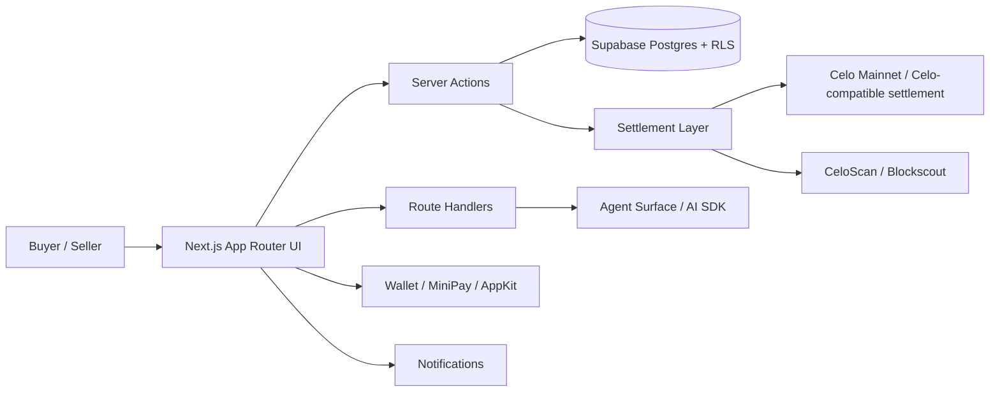

# LANARK

**Execution-layer marketplace agentic on-chain for B2B/B2C commerce on Celo.**

LANARK is a modular marketplace that combines traditional e-commerce UX with agentic execution, on-chain settlement, and mobile-first stablecoin payments. It is designed so a buyer can discover products, build a cart, authorize payment, and review the transaction history, while each seller manages its own storefront, inventory, orders, and metrics.

The product is built around a clear principle:

> **Commerce stays practical off-chain; settlement and traceability stay verifiable on-chain.**

---

## What LANARK does

LANARK lets people:

- Browse merchants and products
- Add products to a persistent cart
- Complete checkout from a mobile-first surface
- Authorize payment with a wallet flow
- Store and display transaction references
- Inspect order history and CeloScan links
- Operate a seller dashboard with real business metrics
- Interact with an agent that helps execute commerce actions

LANARK is not just a catalog. It is an **execution layer** for commerce.

---

## Why this project exists

Traditional e-commerce often separates:

- Discovery
- Checkout
- Payment
- Traceability
- Merchant operations

LANARK connects those layers into one system:

- the **buyer** gets a simple, guided purchase flow
- the **seller** gets a clean operational dashboard
- the **chain** provides settlement visibility and evidence
- the **agent** helps bridge intent into action

This is especially relevant for mobile commerce, emerging markets, and stablecoin-based transactions.

---

## Product principles

- **One checkout belongs to one shopkeeper**
- **The cart is persistent**
- **The buyer sees the real order state**
- **The seller only sees their own storefront**
- **The transaction hash is visible**
- **The order history is auditable**
- **The UX must feel fast and low-friction**
- **The chain must add value, not complexity**

---

## Architecture overview



---

## Core modules

### 1) Marketplace
The marketplace is the customer-facing discovery surface. It supports:

- Products
- Stores / Merchants
- Categories
- Search
- Filters
- Horizontal browsing by store
- Mobile-first exploration

### 2) Cart
The cart is a persistent commerce state, not a temporary UI toy.

It must preserve:

- Selected products
- Quantities
- Seller boundaries
- Checkout state
- Price integrity

### 3) Checkout
Checkout is where the purchase becomes executable.

It handles:

- Order creation
- Authorization
- Payment approval
- Settlement readiness
- Transaction visibility
- Post-purchase history refresh

### 4) Agent Surface
The agent surface turns commerce intent into action.

The agent helps the buyer:

- Search products
- Find the right store
- Add items
- Checkout
- Follow the order state
- Text or voice

### 5) Seller Dashboard
The seller dashboard is the operational control center for the shopkeeper.

It should show:

- Orders received
- Daily sales
- Revenue
- Top products
- Recurring buyers
- Inventory status
- Transaction history
- Settlement status

### 6) Wallet / History
The wallet and history surfaces provide:

- Account context
- Wallet address
- Current network
- Balances
- Order history
- CeloScan links

### 7) Settlement Layer
The settlement layer is responsible for the on-chain side of commerce:

- Escrow / authorization flow
- Transaction hashing
- Receipt tracking
- On-chain traceability
- Order state updates

---

## Networks and currency model

### Primary network
LANARK is built for **Celo Mainnet** as the production settlement environment.

### Stablecoins
The product supports a stablecoin-first commercial model.

- **COPm**: default commercial stablecoin
- **USDm**: canonical stablecoin unit for broader  flows

### Gas / execution
The user experience is simple for end users. The flow is designed to resemble gas-sponsored transactions on the first transaction; the actual settlement remains on the blockchain and is auditable.

### Important principle
- **Catalog, inventory, orders, and merchant operations stay off-chain**
- **Settlement, traceability, and proof of execution are anchored on-chain**

---

## Agentic commerce flow

### Buyer flow

1. Browse stores and products
2. Add products to the cart
3. Review checkout
4. Confirm shipping information
5. Authorize payment
6. Sign the transaction in the wallet
7. Receive order confirmation
8. View tx hash
9. Open order history

### Seller flow

1. Manage storefront
2. Publish products
3. Update inventory
4. Receive orders
5. Track sales and metrics
6. Monitor settlement state
7. Follow recurring customer behavior

---

## Data model philosophy

LANARK is modular and server-action driven.

The system is organized around:

- `store`
- `product`
- `cart`
- `cart_item`
- `order`
- `order_item`
- `settlement`
- `order_event`
- `profile`
- `wallet`
- `notification`

### Rules

- Each checkout belongs to a single seller/store
- Order state must be explicit
- Amounts must have one canonical conversion path
- Data validation must be server-side
- Seller data must stay isolated by tenant / role
- Buyer and seller surfaces must remain separated

---

## On-chain / off-chain boundary

### Off-chain
Used for:

- Catalog operations
- Cart state
- Merchant profile
- Shipping address
- Notifications
- Analytics
- Business metrics
- Agent orchestration

### On-chain
Used for:

- Settlement evidence
- Transaction proof
- Address / hash traceability
- Escrow-style commerce logic
- Verifiable state transitions

### Future privacy layer
LANARK is compatible with privacy-preserving and zero-knowledge proof  for compliance and identity proofs where needed.

---

## MiniPay compatibility

LANARK is designed to work in a mobile-first Celo environment, including MiniPay.

- MiniPay
- use the wallet provided by the environment
- Avoid forcing a secondary wallet setup
- Keep the checkout flow simple
- Maintain stablecoin-first commerce
- Keep transaction references visible
- Preserve the regular browser flow outside MiniPay

---

## Legal / compliance mindset

LANARK is designed with practical compliance in mind:

- merchant identity can be extended with country-specific business data
- profile data should support structured commercial information
- address and contact data should be persisted securely
- sensitive data should not be exposed in the client unnecessarily
- future compliance and verification layers can be added without rewriting the core flow

---

## Privacy and verification roadmap

The project can evolve toward:

- proof-based identity assertions
- seller verification
- compliance proofs
- privacy-preserving account attestations

---

## Tech stack

- **Next.js 16**
- **React 19**
- **TypeScript**
- **Supabase** (Postgres, auth, RLS)
- **Celo** (mainnet settlement)
- **Foundry** (contracts)
- **wagmi / viem**
- **Reown AppKit / MiniPay-compatible wallet flows**
- **AI SDK / agent surface**
- **Vercel** for production deployment

---

## Development Workflow

### 1. Install dependencies

```bash
npm install
```

### 2. Start the development environment

```bash
npm run dev
```

### 3. Static analysis

Before creating commits or pull requests, validate the project.

```bash
npm run lint
npm run typecheck
```

or

```bash
npx tsc --noEmit
```

---

### 4. Production verification

Every production release must successfully complete the build pipeline.

```bash
npm run build
npm run start
```

---

### 5. Smart Contract Validation

LANARK's settlement layer is developed using Foundry.

```bash
forge build
forge test
```

---

### Deployment

- Deploy contracts to the target Celo network
- Update environment variables
- Verify explorer links and transaction history

---


Typical groups include:

- **Celo / chain**

- **Supabase**

- **AI / agent**

- **Observability**

- **Notifications**


---


## Repository intent

It combines:

- E-commerce UX
- Agentic execution
- On-chain settlement
- Mobile-first payment flows
- Merchant operations
- Stablecoin commerce
  
The goal is to make commerce **more executable, more traceable, and more usable**.

---

## Roadmap

### Now
- Stabilize checkout
- Keep wallet and transaction flow reliable
- Preserve production stability
- Ensure dashboard and history are accurate

### Next
- MiniPay integration
- Notifications
- Merchant onboarding improvements
- Privacy / proof-based extensions

### Later
- More advanced compliance layers
- Zero-knowledge proof-based attestations
- Richer automation across buyer and seller agents

---

## Summary

LANARK is an **agentic execution-layer marketplace** for B2B/B2C commerce on Celo.

It separates:

- **off-chain commerce operations**
- **on-chain settlement and traceability**

and connects them through:

- A buyer-friendly cart and checkout
- Seller-specific operations
- Wallet-driven authorization
- Transaction history
- Stablecoin settlement
- Mobile-first execution
