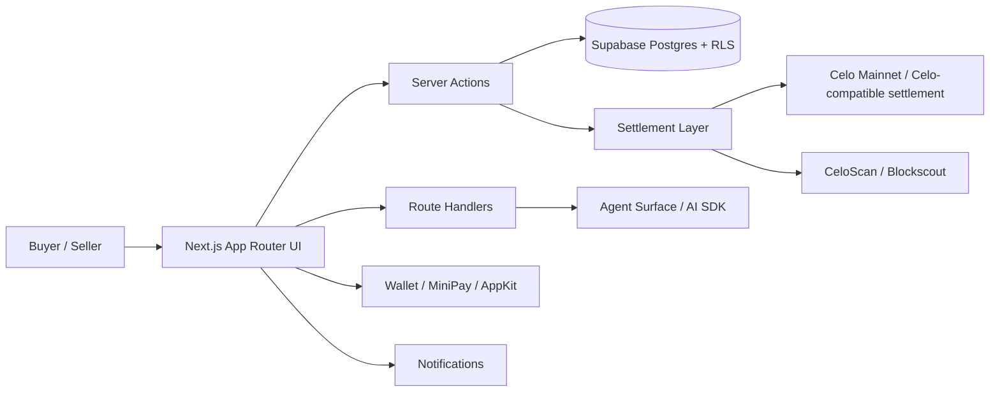
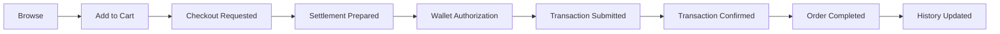

# LANARK

**Execution-layer marketplace agentic on-chain for B2B/B2C commerce on Celo.**

LANARK is a modular commerce platform that combines traditional e-commerce UX with agentic execution, on-chain settlement, and mobile-first stablecoin payments. It is designed so a buyer can discover products, build a cart, authorize payment, and review the transaction history, while each seller manages its own storefront, inventory, orders, and metrics.

The product follows a clear principle:

> **Commerce stays practical off-chain; settlement and traceability stay verifiable on-chain.**

---

## Table of contents

- [What LANARK is](#what-lanark-is)
- [Why LANARK](#why-lanark)
- [Product principles](#product-principles)
- [Architecture overview](#architecture-overview)
- [Core modules](#core-modules)
- [Commerce execution lifecycle](#commerce-execution-lifecycle)
- [Networks and currency model](#networks-and-currency-model)
- [Data model philosophy](#data-model-philosophy)
- [On-chain / off-chain boundary](#on-chain--off-chain-boundary)
- [MiniPay compatibility](#minipay-compatibility)
- [Security and compliance mindset](#security-and-compliance-mindset)
- [Observability](#observability)
- [Tech stack](#tech-stack)
- [Development workflow](#development-workflow)
- [Environment variables](#environment-variables)
- [Deployment](#deployment)
- [Repository structure](#repository-structure)
- [Roadmap](#roadmap)
- [License](#license)

---

## What LANARK is

LANARK is an **execution-layer marketplace** for commerce on Celo.

It is a system that connects:

- product discovery
- cart state
- checkout
- wallet authorization
- settlement
- order history
- merchant operations
- transaction traceability

The platform is built to support both:

- **B2C** commerce, where a buyer purchases from a seller through a guided checkout
- **B2B** commerce, where the same execution model can support more structured and higher-value commercial workflows

---

## Why LANARK

Traditional e-commerce often separates:

- discovery
- checkout
- payment
- traceability
- merchant operations

LANARK connects those layers into one system:

- the **buyer** gets a simple, guided purchase flow
- the **seller** gets a clean operational dashboard
- the **chain** provides settlement visibility and evidence
- the **agent** helps bridge intent into action

This is especially relevant for:

- mobile commerce
- emerging markets
- stablecoin-based transactions
- merchant-led commerce
- wallet-native user experiences
- Celo-native payment rails

---

## Product principles

- **One checkout belongs to one shopkeeper**
- **The cart is persistent**
- **The buyer sees the real order state**
- **The seller only sees their own storefront**
- **The transaction hash is visible**
- **The order history is auditable**
- **The UX must feel fast and low-friction**
- **The chain must add value, not complexity**
- **The domain must stay multi-tenant and isolated**
- **The payment flow must remain explicit and verifiable**

---

## Architecture overview



### How to read the architecture

- **Next.js App Router UI** handles the user experience.
- **Server Actions** own business mutations and validations.
- **Route Handlers** expose API surfaces used by the agent and the client.
- **Supabase Postgres + RLS** is the commerce data layer.
- **Agent Surface / AI SDK** converts intent into controlled commerce actions.
- **Settlement Layer** handles payment preparation and blockchain traceability.
- **Celo Mainnet** is the settlement environment.
- **CeloScan / Blockscout** provides public proof and transaction inspection.
- **Wallet / MiniPay / AppKit** is the authorization surface.
- **Notifications** provide post-purchase feedback and follow-up.

---

## Core modules

### 1) Marketplace

The marketplace is the customer-facing discovery surface. It supports:

- products
- stores / merchants
- categories
- search
- filters
- horizontal browsing by store
- mobile-first exploration

The marketplace is intentionally optimized for fast browsing and clear product discovery.

---

### 2) Cart


- selected products
- quantities
- seller boundaries
- checkout state
- price integrity


---

### 3) Checkout

Checkout is where the purchase becomes executable.

It handles:

- order creation
- authorization
- payment approval
- settlement readiness
- transaction visibility
- post-purchase history refresh

Checkout is treated as a state machine, not a single button click.

---

### 4) Agent Surface

The agent surface turns commerce intent into action.

The agent helps the buyer:

- search products
- find the right store
- add items
- checkout
- follow the order state
- text or voice

The agent is constrained by business rules and server-side validation. It assists execution; it does not directly mutate financial state.

---

### 5) Seller Dashboard

The seller dashboard is the operational control center for the shopkeeper.

It should show:

- orders received
- daily sales
- revenue
- top products
- recurring buyers
- inventory status
- transaction history
- settlement status

The seller dashboard exists to make store operations visible and manageable.

---

### 6) Wallet / History

The wallet and history surfaces provide:

- account context
- wallet address
- current network
- balances
- order history
- CeloScan links

This is the visibility layer for the buyer and the seller.

---

### 7) Settlement Layer

The settlement layer is responsible for the on-chain side of commerce:

- authorization / escrow flow
- transaction hashing
- receipt tracking
- on-chain traceability
- order state updates

---
### 8) Contracts

LanarkEscrowFactory

- Escrow

- Settlement Token

- Worker

- Escrow lifecycle

- release()

- refund()

- prepare()

- deposit()

---


## Commerce execution lifecycle

LANARK models commerce as a deterministic lifecycle.



### Lifecycle rules

- The cart is prepared before payment.
- The buyer explicitly authorizes the payment.
- The transaction hash is persisted as soon as it exists.
- The order updates as the chain confirms the action.
- The history reflects the final state.
- The user can inspect the on-chain proof of execution.

---

## Networks and currency model

### Primary network

LANARK is built for **Celo Mainnet** as the production settlement environment.

### Stablecoins

The product supports a stablecoin-first commercial model.

- **COPm**: default commercial stablecoin
- **USDm**: canonical stablecoin unit for broader flows

### Gas / execution

The user experience is designed to keep the gas discussion out of the buyer’s way.

- the user authorizes the purchase
- the system handles the commercial workflow
- settlement remains auditable on-chain

### Important principle

- **Catalog, inventory, orders, and merchant operations stay off-chain**
- **Settlement, traceability, and proof of execution are anchored on-chain**

---

## Data model philosophy

LANARK is modular and server-action driven.

The system is organized around:

- `store`
- `product`
- `cart`
- `cart_item`
- `order`
- `order_item`
- `settlement`
- `order_event`
- `profile`
- `wallet`
- `notification`

### Rules

- each checkout belongs to a single seller/store
- order state must be explicit
- amounts must have one canonical conversion path
- data validation must be server-side
- seller data must stay isolated by tenant / role
- buyer and seller surfaces must remain separated

---

## On-chain / off-chain boundary

### Off-chain

Used for:

- catalog operations
- cart state
- merchant profile
- shipping address
- notifications
- analytics
- business metrics
- agent orchestration

### On-chain

Used for:

- settlement evidence
- transaction proof
- address / hash traceability
- escrow-style commerce logic
- verifiable state transitions

### Future privacy layer

LANARK can evolve toward:

- proof-based identity assertions
- seller verification
- compliance proofs
- privacy-preserving account attestations

---

## MiniPay compatibility

LANARK is designed to work in a mobile-first Celo environment, including MiniPay.

- use the wallet provided by the environment
- avoid forcing a secondary wallet setup
- keep the checkout flow simple
- maintain stablecoin-first commerce
- keep transaction references visible
- preserve the regular browser flow outside MiniPay

MiniPay is treated as a native execution environment for mobile users, not as a special-case demo mode.

---

## Security and compliance mindset

LANARK is designed with practical compliance in mind:

- merchant identity can be extended with country-specific business data
- profile data should support structured commercial information
- address and contact data should be persisted securely
- sensitive data should not be exposed in the client unnecessarily
- future compliance and verification layers can be added without rewriting the core flow

### Multi-tenant isolation

Seller data must remain isolated by policy, not by frontend convention.

That means:

- the seller sees only their own records
- row-level rules enforce isolation
- the database remains the source of truth for access control
- the UI is not trusted to enforce tenant boundaries

---

## Observability 

- order lifecycle
- settlement lifecycle
- authorization latency
- wallet interaction success
- transaction receipt status
- notification delivery
- dashboard refresh behavior

### Failure recovery mindset

LANARK should be resilient to:

- wallet refusal
- missing transaction hash
- incomplete settlement
- transient RPC failures
- null profile data
- incomplete order state
- re-render crashes in server components

The platform should fail with explicit messages and recover cleanly where possible.

---

## Tech stack

- **Next.js 16**
- **React 19**
- **TypeScript**
- **Supabase** (Postgres, auth, RLS)
- **Celo** (mainnet settlement)
- **Foundry** (contracts)
- **wagmi / viem**
- **Reown AppKit / MiniPay-compatible wallet flows**
- **AI SDK / agent surface**
- **Vercel** for production deployment

---

## Development workflow

### 1) Install dependencies

```bash
npm install
```

### 2) Start the development environment

```bash
npm run dev
```

### 3) Static analysis

Before creating commits or pull requests, validate the project.

```bash
npm run lint
npm run typecheck
```

or

```bash
npx tsc --noEmit
```

### 4) Production verification

Every production release must successfully complete the build pipeline.

```bash
npm run build
npm run start
```

### 5) Smart contract validation

LANARK's settlement layer is developed using Foundry.

```bash
forge build
forge test
```

Optional checks, depending on the project state:

```bash
forge fmt
forge snapshot
```

---

## Environment variables

LANARK relies on environment variables for secure execution.   

### Typical categories

- **Celo / chain**
- **Supabase**
- **AI / agent**
- **Observability**
- **Notifications**
- **Wallet / settlement**

### Examples

```env
LANARK_CHAIN_ID=42220
NEXT_PUBLIC_LANARK_CHAIN_ID=42220

CELO_RPC_URL=https://forno.celo.org
NEXT_PUBLIC_CELO_RPC_URL=https://forno.celo.org

LANARK_ESCROW_FACTORY=0x...

NEXT_PUBLIC_SUPABASE_URL=...

CELOSCAN_API_KEY=
```

Only keep values that are actually used by the current codebase.

---

## Deployment

Deployment consists of two independent layers.

### Application layer

- deploy the Next.js application
- configure server environment variables
- configure client environment variables
- verify production health endpoints

### Settlement layer

- deploy settlement contracts to the target Celo network
- verify deployed contracts
- configure settlement addresses
- validate escrow creation
- validate payment execution
- validate settlement events
- verify transaction history through blockchain explorers

### Deployment checklist

- build passes
- env vars exist
- wallet flow is working
- checkout is working
- transaction hashes are visible
- history reflects final state
- explorer links resolve
- production routes respond correctly

---

## Repository structure

```text
app/          Next.js App Router pages, layouts, actions, and route handlers
components/   Shared UI, dashboards, cart, agent surface, wallet surfaces
contracts/    Foundry smart contracts for settlement and escrow
hooks/        Client-side and workflow hooks
lib/          Business logic, pricing, settlement, AI helpers, Supabase clients
scripts/      Deployment, migration, verification, operational scripts
sql/          Database schema, migrations, and RLS policies
public/       Static assets
```

The repository is intentionally separated by responsibility:

- `app/` = orchestration and user-facing routes
- `components/` = reusable surfaces
- `contracts/` = on-chain primitives
- `lib/` = business rules and integrations
- `sql/` = durable data model and access control
- `scripts/` = operational work
- `hooks/` = client behavior
- `public/` = static presentation assets

---

## Roadmap

### Now

- stabilize checkout
- keep wallet and transaction flow reliable
- preserve production stability
- ensure dashboard and history are accurate

### Next

- MiniPay integration
- notifications
- merchant onboarding improvements
- privacy / proof-based extensions

### Later

- more advanced compliance layers
- zero-knowledge proof-based attestations
- richer automation across buyer and seller agents
- distributed orchestration improvements
- stronger observability and recovery tooling

---

## License

Licensed under **Apache 2.0**.

See `LICENSE` for the full text.
